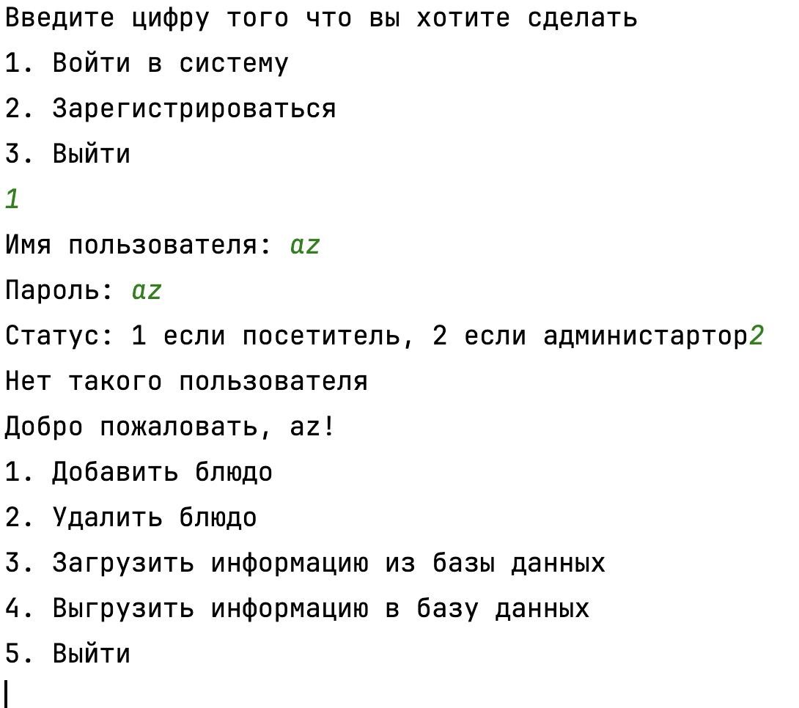

### Применение принципов ООП и SOLID (-0.3)

- *Processing* очень большой, он мог быть так же разгружен, как вы использовали Manager классы или
  хотя бы разбить на приватные методы

### CodeStyle (-0.1)

- нет пакетов
- не везде соблюдён camelCase для методов/аргументов

### Понятный интерфейс (-0.1)

- Странное поведение

  

### Общее (-2)

- Нет опционального задания **(-2)**

### Ошибки (-1)

- Ошибка во время ввода некорректного значения **(-1)**
  

### Итог: 6.5